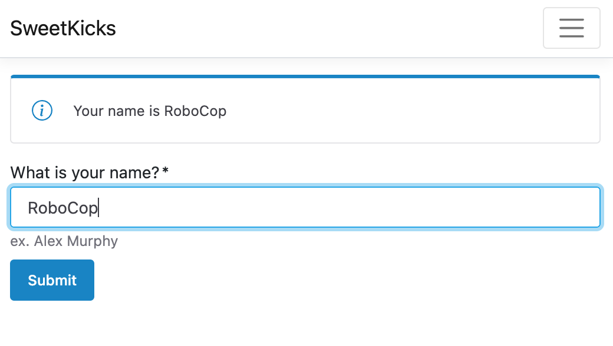

# Shoelace Web Components with ASP.NET Core

Web Components are a powerful way to add UX to your web applications while using the web platform. That makes them ideal as they can be used in various ecosystems with little or no changes. They also require no build pipelines as they are supported natively in most clients. This is in stark contrast to approaches like React or Blazor.

A mature web component library like [Shoelace](https://shoelace.style) allows you to share common UI components with teams working on different technology stacks. This can create a consistent user experience regardless of the server technology used to render the pages. Take advantage of server-side rendering strengths without heavy SPA libraries or confusing build pipelines.

In this repository, you will find a sample using Shoelace components that work with ASP.NET Core Razor Pages and TagHelpers.

## What is a Web Component?

A [web component](https://en.wikipedia.org/wiki/Web_Components) is a reusable component written to take advantage of the standard component model built into some of the most popular web clients, such as Chrome, Firefox, and Safari. The component model includes three sets of technologies, and a web component can take advantage of one or all of them: Custom Elements, Shadow DOM, and HTML Templates.  

The goal of web components is to reduce unnecessary overhead by building commonly run tasks into the web platform itself. This helps increase interoperability across UI frameworks and improve the performance of many frontend experiences.

## What is Shoelace?

Shoelace is a "forward-thinking library for web components." The library attempts to create reusable UI elements that you can utilize as-is or within other existing UI frameworks, such as React, Vue, or Angular. Some of these components include common patterns such as input elements, badges, buttons, alerts, and so many more. Shoelace also provides consumers with a stylistic starting point, but allows for all component details to be altered.  

To get started with Shoelace is straightforward, as all you need is to register the library in your web pages `head` tag.

```html
<link rel="stylesheet" href="https://cdn.jsdelivr.net/npm/@shoelace-style/shoelace@2.12.0/cdn/themes/light.css" />
<script type="module" src="https://cdn.jsdelivr.net/npm/@shoelace-style/shoelace@2.12.0/cdn/shoelace-autoloader.js"></script>
```

You can also choose to selectively bundle Shoelace using a JavaScript build pipeline, but this step is optional.

## Adding Shoelace to ASP.NET Core

There are not that many steps required to add Shoelace to an existing ASP.NET Core application. Shoelace also integrates well with existing UI libraries such as Bootstrap. 

In a new ASP.NET Core project, replace the top of the `_Layout.cshtml` file with the following markup.

```razor
@{
    const string shoelaceStylesheet = "https://cdn.jsdelivr.net/npm/@shoelace-style/shoelace@2.12.0/cdn/themes/light.css";
    const string shoelaceJavaScript = "https://cdn.jsdelivr.net/npm/@shoelace-style/shoelace@2.12.0/cdn/shoelace-autoloader.js";
}

<!DOCTYPE html>
<html lang="en">
<head>
    <meta charset="utf-8"/>
    <meta name="viewport" content="width=device-width, initial-scale=1.0"/>
    <title>@ViewData["Title"] - SweetKicks</title>
    <link rel="stylesheet" href="~/lib/bootstrap/dist/css/bootstrap.min.css"/>
    <link rel="stylesheet" href="~/css/site.css" asp-append-version="true"/>
    <link rel="stylesheet" href="~/SweetKicks.styles.css" asp-append-version="true"/>
    <link rel="stylesheet" href="@shoelaceStylesheet" />
    <script type="module" src="@shoelaceJavaScript"></script>
    @await RenderSectionAsync("headScripts", required: false)
</head>
```

If you want the URLs inline, you will need to escape the `@` symbols with `@@`. In this case, I thought it would be easier to read if I moved the URLs to the beginning of the file.

I have added an extra section of `headScripts`, which we will use later.

The most essential element of this code snippet is the script reference to `shoelace-autoloader.js`, which scans the page for shoelace components and then auto-wires those components into the known set of custom elements. Without this, elements would not render and be visible to users.

Let's add some code to our `Index.cshtml.cs` to set up for the eventual use of Shoelace components.

```csharp
using Microsoft.AspNetCore.Mvc;
using Microsoft.AspNetCore.Mvc.RazorPages;

namespace SweetKicks.Pages;

public class IndexModel(ILogger<IndexModel> logger) : PageModel
{
    [TempData]
    public string? Name { get; set; }
    
    public void OnGet()
    {
    }

    public RedirectToPageResult OnPost([FromForm] string name)
    { 
        logger.LogInformation("Name is {Name}", name);
        Name = name;
        return RedirectToPage();
    }
}
```

Before we get to using the Shoelace components, we need to let ASP.NET Core know about the `sl-input` component we'll be using so we can take advantage of tag helpers. Place the following file anywhere in the project.

```csharp
using JetBrains.Annotations;
using Microsoft.AspNetCore.Mvc.TagHelpers;
using Microsoft.AspNetCore.Mvc.ViewFeatures;
using Microsoft.AspNetCore.Razor.TagHelpers;

namespace SweetKicks.TagHelpers;

[UsedImplicitly]
[HtmlTargetElement("sl-input", Attributes = "asp-for", TagStructure = TagStructure.WithoutEndTag)]
public class ShoelaceInputTagHelper(IHtmlGenerator generator) 
    : InputTagHelper(generator);
```

Also, be sure to register the new tag helper in `_ViewImports.cshtml` making sure to adjust the namespace according to your needs.

```razor
@using SweetKicks
@namespace SweetKicks.Pages
@addTagHelper *, Microsoft.AspNetCore.Mvc.TagHelpers
@addTagHelper *, SweetKicks
```

Now, let's use some Shoelace components. In `Index.cshtml`, we can replace the following HTML with the following markup.

```razor
@page
@model IndexModel
@{
    ViewData["Title"] = "Home page";
}

<div>
    @if (Model.Name is not null)
    {
        <sl-alert open>
            <sl-icon slot="icon" name="info-circle"></sl-icon>
            Your name is @Model.Name
        </sl-alert>
    }

    <form method="post" asp-page="Index" class="my-3">
        <sl-input label="What is your name?"
                  type="text"
                  asp-for="Name"
                  help-text="ex. Alex Murphy"
                  required
                  autofocus>
        </sl-input>
        <sl-button class="mt-2" variant="primary" type="submit">Submit</sl-button>
    </form>
</div>
```

Running the application now shows our input element. Submitting the form will also show the alert notification.



If you take a look at the markup again, you'll notice that a single `sl-input` got us a user experience that includes a label, a placeholder, and input. Additionally, with our `ShoelaceInputTagHelper` class, we now have ASP.NET Core support for web components. Not bad at all.

## Flash Of Content Fixes

Eagle-eyed developers may have noticed a flash of undefined content as the components were rendered. There are several fixes to this, with them [coming from this blog post](https://www.abeautifulsite.net/posts/flash-of-undefined-custom-elements/).

The first and simplest fix is to use a CSS style in the `site.css`.

```css
:not(:defined) {
  visibility: hidden;
}
```

This won't render any undefined elements, including any sub content. This is OK, but can still be jarring.

The second fix is to add the following CSS to the `site.css` stylesheet.

```css
body {
  margin-bottom: 60px;
  opacity: 0;
}

body.ready {
  opacity: 1;
  transition: .25s opacity;
}
```

Then to modify either the `_Layout.cshtml` or `Index.cshtml` file with the following JavaScript snippet.

```html
<script type="module">
      /* note: this will block rendering if forget
         using a mentioned custom component. 
       ex. sl-not-a-real-component */
      await Promise.allSettled([
        customElements.whenDefined('sl-input'),
        customElements.whenDefined('sl-button'),        
      ]);
          
      document.body.classList.add('ready');
</script>
```

As noted in the comment, this approach will block the page rendering until the client is finished registering the mentioned components. After they are done loading, the page will transition from `0` to `1` opacity. This provides a nice experience, but has the downside of needing to track all components that are used on a page.

I personally prefer the first approach as you'd less likely break the entire page by accidentally removing an element that you had previously registered.

## Conclusion

Web Components are awesome and are the future of web development. There are still some caveats, but in my opinion, they can help reduce vendor lock-in and ultimately
provide more value to teams who may be doing polyglot development. There's also a world of unexplored possibilities with web components depending on your approach. With Shoelace, all components encapsulate functionality, and that's great for feature reuse. There's another approach of progressive enhancement components that can take existing HTML and enrich it with additional client-side features. I highly recommend you check out the other components in the [Shoelace](https://shoelace.style) component library.

As always, thanks for reading and sharing my posts.
